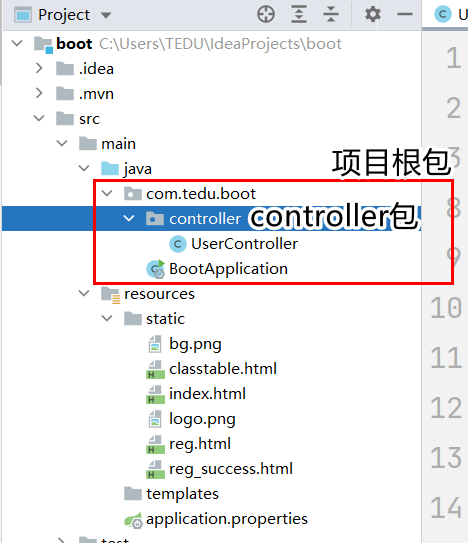

# SpringBoot项目

## 创建SpringBoot项目

步骤:

第一步:新建一个项目


第二步:选择SpringBoot项目，按照图上的步骤选择并输入对应内容，之后点击next进行下一步。
注:第二小步可改用阿里云:https://start.aliyun.com


第三步:勾选Spring Web，并点击finish完成项目的创建


## SpringBoot项目结构

项目根包:SpringBoot项目要求我们将来定义的类和包必须放在这个包下

项目启动类:SpringBoot项目自动生成，里面包含main方法，用来启动

静态资源目录:用来保存当前web应用(我们的网站)中所有的静态资源(页面，图片和其他素材)


## html基础

HTML是超文本标记语言，用来构成一个"网页"的语言。由W3C(万维网)制定。

#### 构成一个页面的基本结构:

```
<!DOCTYPE html>
<html lang="en">
<head>
    <meta charset="UTF-8">
    <title>title</title>
</head>
<body>

</body>
</html>
```

html标签是html页面的根标签，里面包含两个子标签head和body

head标签是头信息，用来指定页面的元数据，这里定义的东西都是给浏览器看的。包括后期用到的CSS，JS的加载

body标签是体信息，里面定义的内容都会呈现在浏览器中给用户看到。

#### html常用标签介绍:

```html
<h1>-<h6>标签:标题。每级标题的字体大小不同，标题独占一行

<center>标签:将标签中间的内容全部基于浏览器居中显示。该标签在HTML5中已经不再
            建议使用了

<input>标签:输入组件，用于在浏览器中获取用户输入的组件。组件有多种，使用type属性
           定义不同输入组件，常用的有:
           type="text" 默认值，表示一个文本输入框
           type="password" 密码框
           type="button" 按钮
           type="submit" 提交表单按钮
           type="checkbox" 多选框
           type="radio" 单选框
           注:单选框和复选框使用name属性分组，名字相同的为一组。

<br>标签:换行

<a>标签:超链接。标签中间的文本是超链接上提示的文字，属性href用于指定跳转路径

<table>标签:表格。属性border用于指定边框。
            <table>标签中包含<tr>标签用于表示行
            <tr>标签中包含<td>标签用于表示列
            <td>标签中常见属性:
            align:对其方式。left左对齐,right右对齐,center剧中对其
            colspan:跨列合并列，合并是从左向右合并列
            rowspan:跨行合并列，合并是从上向下合并列

标签:图片。属性src用于指定图片的路径
```


### URL-统一资源定位


#### 请求服务端页面时，浏览器地址栏上输入URL地址的规则:

```
根据URL的主机地址信息我们可以找到我们的服务器(Tomcat),抽象路径部分最开始的"/"则是让服务器去项目的static目录下找对应的资源文件
```


#### 在页面上指定其他资源的路径时的规则：

```
我们在html页面上经常会使用超链接或者图片组件，这时我们需要指定路径，这里的路径都是从"/"开始的
这里的"/"就是URL地址中抽象路径部分最开始的"/"
```


#### 表单的使用:

```
form表单是用于将用户在页面上输入的信息提交给服务端使用的组件。
form表单中应当包含若干的输入组件.
注意:只有包含早form标签中间的输入组件中用户输入的信息才会提交给服务端!!

form上有两个重要的属性:
action:用于指定表单提交的路径，该路径需要服务端配合处理
method:表单提交的形式，有两个可选项:
       GET:地址栏形式提交，表单数据会拼接到地址栏的URL中传递
       POST:表单数据会被包含在请求的消息正文中被提交
       当表单数据含有用户隐私信息或附件上传时应当使用POST。

       method属性不指定时，默认是GET请求提交。

表单中应当包含一个提交按钮，该按钮点击后会将这个表单进行提交。
```


## Controller的创建

Controller是所有处理业务请求的类的统称，我们可以创建一个包controller保存实际处理业务的所有Controller类，需要注意几个事项:

1. controller包需要放在项目的根包下

   

2. Controller上要定义@Controller注解，否则Spring MVC框架不识别该类

3. 处理业务的方法要定义@RequestMapping注解，且参数要与页面表单中action的值一致

   

4. 获取表单信息

   使用请求对象:request.getParameter()获取，这里方法参数为一个字符串要与表单中输入框名字一致

   

   

